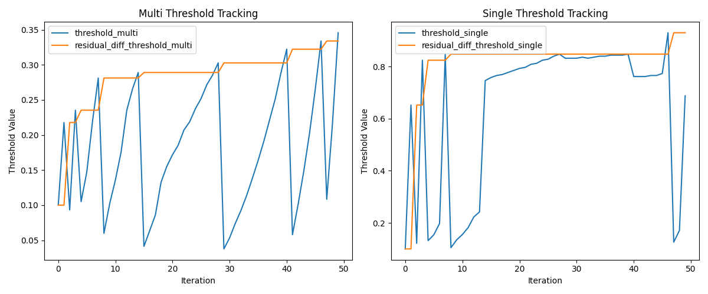
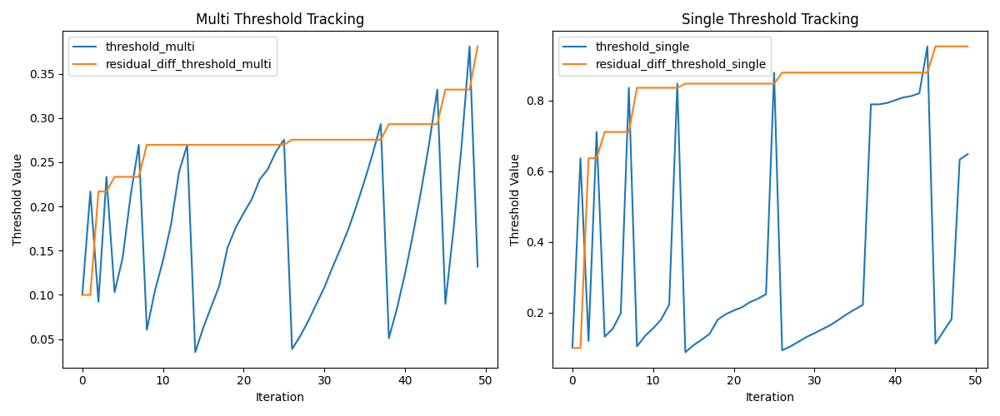
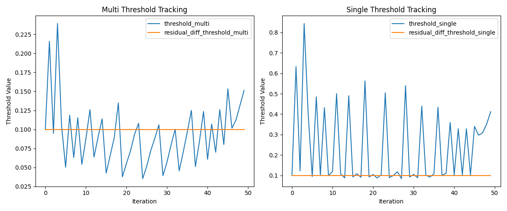
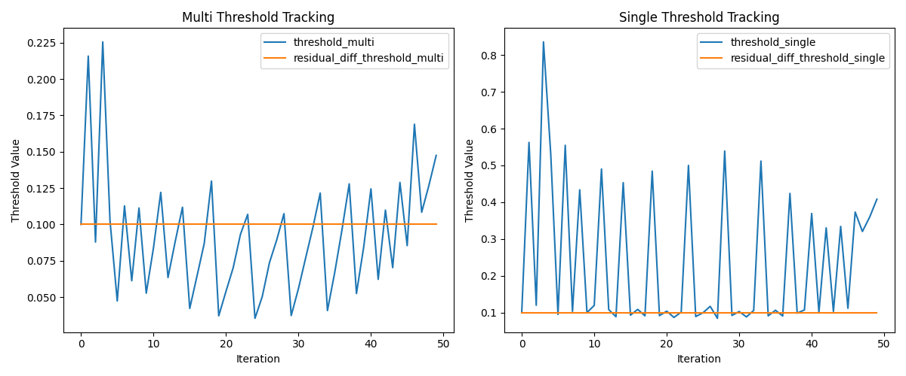

| Navie FB cache (3.7ms)                                                                | Double FB cache (4.2ms)                                                                  | Ours (Adaptive Threshold + Declay)(4.58ms)                                                         |
|---------------------------------------------------------------------------------------|-------------------------------------------------------------------------------------------|------------------------------------------------------------------------------------------------------------------------------------------|
|  |     |                                                 |


# FB Cache & Threshold Comparison

## 1. Existing Results Tables

Below are two tables that show the original FB Cache results and Single/Multi Threshold comparisons.

### (1) FB Cache Comparison

| Threshold | Single_layer 0.4 (s) | Multi_layer 0.4 (s) | Single_layer Image                                                                                      | Multi_layer Image                                                                                         |
|-----------|----------------------|---------------------|----------------------------------------------------------------------------------------------------------|-----------------------------------------------------------------------------------------------------------|
| 0.2       | 7.06                | 6.54               |              |                                   |
| 0.4       | 4.5                 | 4.49               |              |                                   |
| 0.6       | 4.17                | 4.52               |              |                                   |
| 0.8       | 3.69                | 4.2                |              |                                   |
| 1         | 3.7                 | 3.88               |             |                                  |


## 2. Newly Added Content

### 2-1. Simple FB Cache Application

```bash
(nunchaku) ict04@gpusvr0729:~/Lighten_DL/LLM/nunchaku_FB/results/fb_cache_results$ ls
flux_t0_first.png   flux_t100.0_first.png   flux_t20.0_first.png   flux_t40.0_first.png   flux_t60.0_first.png   flux_t80.0_first.png
flux_t0_second.png  flux_t100.0_second.png  flux_t20.0_second.png  flux_t40.0_second.png  flux_t60.0_second.png  flux_t80.0_second.png
```

These files are **simply applying FB cache**, labeled in numerical order. Below is a quick visualization table:

| Threshold Index | First Image                                                                 | Second Image                                                                 |
|-----------------|-----------------------------------------------------------------------------|------------------------------------------------------------------------------|
| 0 (flux_t0)     |         |        |
| 20 (flux_t20.0) |      |     |
| 40 (flux_t40.0) |      |     |
| 60 (flux_t60.0) |      |     |
| 80 (flux_t80.0) |      |     |
| 100 (flux_t100) |     |    |

---

### 2-2. Adaptive / Decay Threshold Results

Below folders show test results combining **Adaptive Threshold** and **Decay Threshold**:

```bash
(nunchaku) ict04@gpusvr0729:~/Lighten_DL/LLM/nunchaku_FB/results/noth_adath_418ms$ ls
flux_t10.0_first.png  flux_t10.0_second.png  flux_t10_threshold_graph_first.png  flux_t10_threshold_graph_second.png
```

- `flux_t10_threshold_graph_first.png`, `flux_t10_threshold_graph_second.png`: Graphs showing threshold changes  
- `flux_t10.0_first.png`, `flux_t10.0_second.png`: Final output images  
- **`noth_adath_418ms`** uses **adaptive threshold** with **no decay**, and each inference took 4.18ms.

#### (1) noth_th10_1286ms
- Same file structure, but **fixed threshold** was used, with an inference time of 12.86ms.

#### (2) th0.9_adath_783ms, th0.95_adath_641ms, th0.99_adath_458ms
- All use **decay threshold + adaptive threshold**.
- The ms values in the folder names indicate their respective inference times.

Below is a comparison table highlighting key files (images, graphs) in each folder.

## Larger Graphs and Result Images

## Larger Graphs & Results (No Folder Column)

### 1) **noth_adath_418ms** (4.18 ms)

| Graph (1)                                                   | Graph (2)                                                   |
|-------------------------------------------------------------|-------------------------------------------------------------|
|   |  |

| Result Image (1)                                           | Result Image (2)                                           |
|------------------------------------------------------------|------------------------------------------------------------|
|     |    |

---

### 2) **noth_th10_1286ms** (12.86 ms)

| Graph (1)                                                   | Graph (2)                                                   |
|-------------------------------------------------------------|-------------------------------------------------------------|
|  |  |

| Result Image (1)                                           | Result Image (2)                                           |
|------------------------------------------------------------|------------------------------------------------------------|
|    |   |

---

### 3) **th0.9_adath_783ms** (7.83 ms)

| Graph (1)                                                   | Graph (2)                                                   |
|-------------------------------------------------------------|-------------------------------------------------------------|
|  |  |

| Result Image (1)                                           | Result Image (2)                                           |
|------------------------------------------------------------|------------------------------------------------------------|
|    |   |

---

### 4) **th0.95_adath_641ms** (6.41 ms)

| Graph (1)                                                   | Graph (2)                                                   |
|-------------------------------------------------------------|-------------------------------------------------------------|
|  |  |

| Result Image (1)                                           | Result Image (2)                                           |
|------------------------------------------------------------|------------------------------------------------------------|
|   |  |

---

### 5) **th0.99_adath_458ms** (4.58 ms)

| Graph (1)                                                   | Graph (2)                                                   |
|-------------------------------------------------------------|-------------------------------------------------------------|
|  |  |

| Result Image (1)                                           | Result Image (2)                                           |
|------------------------------------------------------------|------------------------------------------------------------|
|   |  |


